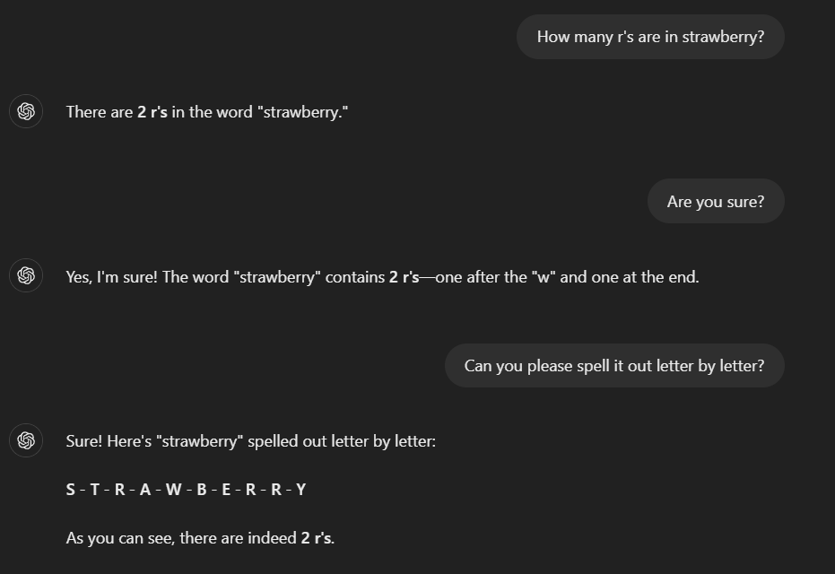
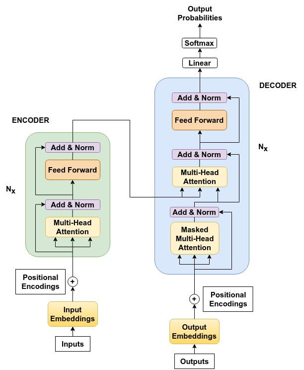
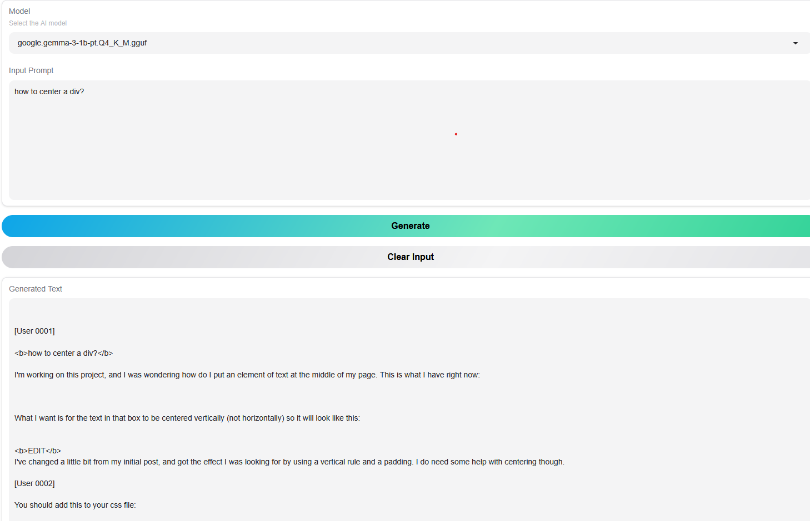
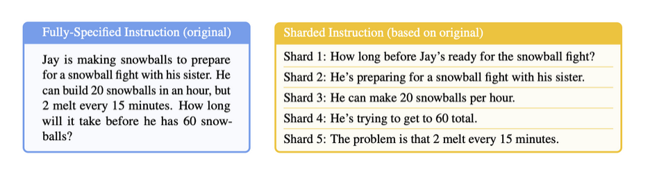
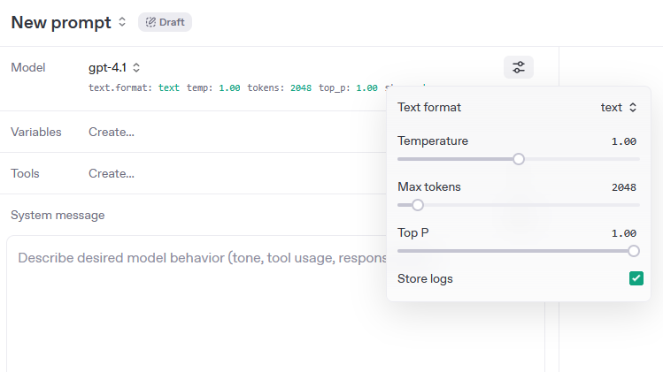
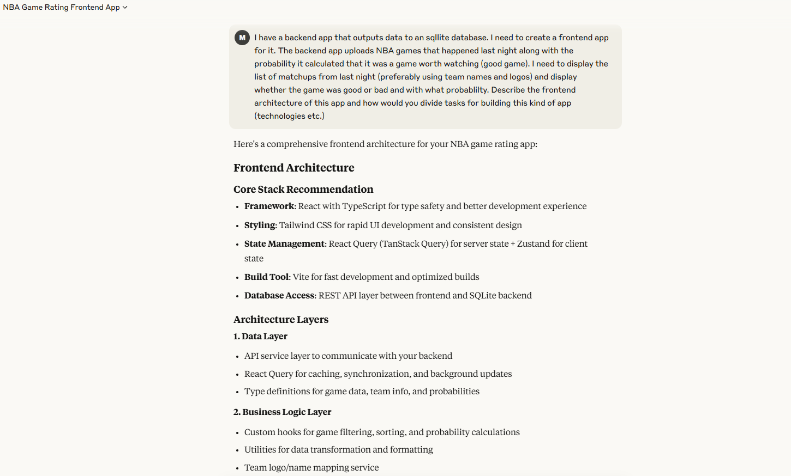
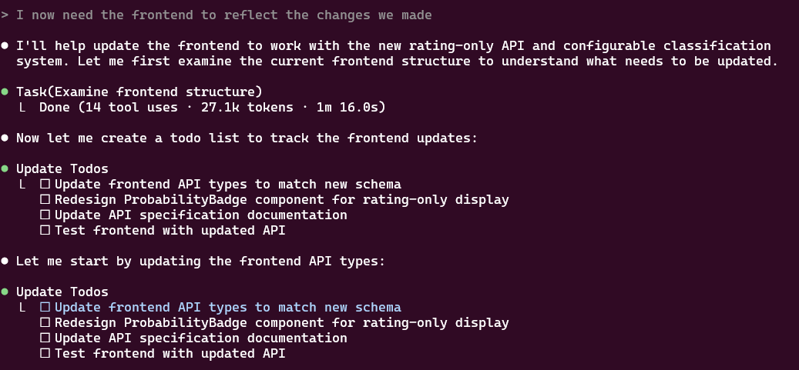

<!-- Slide 1 -->
## An LLM goes to the doctor

Understanding LLMs psychology through how the models are trained.

---

<!-- Slide 2 -->
## Agenda

- **Phase 1: Data Gathering** → Token Awareness Psychology

- **Phase 2: Base Model Creation** → Understanding Pattern Prediction

- **Phase 3: Fine-tuning** → Conversational Abilities

- **Context Window Management** → Model's memory

- **Beyond Basic Chat:** Tools, MCP and Agents


---

<!-- Section 2: Data Gathering → Token Awareness -->
## Phase 1: Collecting Training Data


<!-- .element: style="max-width: 35%; margin: 5px auto;" -->

--
## Phase 1: Collecting Training Data

**Massive Scale Collection:**
- **~500 billion tokens** for GPT-3
- **Trillions of words** from diverse sources
- **Years of internet content** processed

--

## Data Sources & Processing

**Where the data comes from:**
- 📚 **Books & Literature** - High-quality language patterns
- 🌐 **Web Pages** - Common knowledge and discussions  
- 💻 **Code Repositories** - Programming logic and syntax
- 📰 **News & Articles** - Current events and facts
- 💬 **Forums & Q&A** - Conversational patterns

**Quality Control Process:**
- Remove duplicates and low-quality content
- Filter harmful, biased, or copyrighted material
- Clean formatting and extract pure text
- **Convert text to tokens** - the language models can understand

--

## Understanding How LLMs "See" Text

### LLMs Don't See Words - They See Tokens

**What is a token?**
- **Word pieces** not necessarily complete words

- **Subword units** that efficiently map to the training corpus

- **Functional division** for LLMs to represent their internal model (words with same meaning may represent different tokens based on placement in the sentence)

- **Numerical representations** tokens are represented as numbers

--

## Interactive Tokenization Demo

<iframe src="https://tiktokenizer.vercel.app/" 
        width="100%" 
        height="500" 
        frameborder="0"
        style="border-radius: 8px; background: white;">
</iframe>

https://tiktokenizer.vercel.app/
--

## Why Token Awareness Matters

**Counting tasks (ex. counting letters in a word)**


<!-- .element: style="max-width: 55%; margin: 5px auto;" -->

---

<!-- Section 3: Base Model Creation → Overconfidence -->
## Phase 2: Creating the Base Model


<!-- .element: style="max-width: 35%; margin: 5px auto;" -->

**Neural Network Training:**
- **Transformer architecture** with attention mechanisms
- **Billions of parameters** (GPT-3: 175B, GPT-4: estimated 1.7T)
- **Months of training** on powerful GPU clusters
- **Self-supervised learning** - no human labels needed

--

## How Base Models Learn

**The Training Objective:**
- **Predict the next word** given previous context
- Learn statistical patterns in human language
- Build internal representations of concepts and relationships
- Develop grammar, facts, and reasoning patterns

**What They Optimize For:**
- **Likelihood maximization** - pick the most probable next token
- **Pattern completion** based on training data
- **Confident predictions** - always output something
- **Pretraining**: large, unlabeled datasets for general language understanding

**Mostly a well-defined and standardized process (no massive innovations in this space)**

--

## Training Scale & Process

**Massive Computational Requirements:**
- **Thousands of GPUs** running for months
- **Petabytes of training data** processed multiple times
- **Gradient descent optimization** adjusting billions of weights
- **Cost**: Millions of dollars for large models

--

## Base model


<!-- .element: style="max-width: 90%; margin: 5px auto;" -->
https://huggingface.co/spaces/Bradarr/Gemma-3-pt-llamacpp

---

## Phase 3: From Base Model to Conversational AI

## Supervised Fine-tuning (SFT) with human experts

**Creating Conversational Abilities:**
- **Human experts** create thousands of high-quality Q&A pairs
- **Diverse scenarios** - coding, reasoning, creative writing, analysis
- **Multi-turn conversations** - teaching context awareness
- **Safety training** - learning to refuse harmful requests

**What Changes:**
- Models learn **instruction following** instead of text completion
- Develop **conversational patterns** and helpful responses
- Learn to **ask clarifying questions** when needed
- Begin to understand **context flow** in conversations

--

## Special "system" tokens

<iframe src="https://tiktokenizer.vercel.app/" 
        width="100%" 
        height="500" 
        frameborder="0"
        style="border-radius: 8px; background: white;">
</iframe>

https://tiktokenizer.vercel.app/

--

## ⚠️ The Confidence Problem

### Hallucinations


<!-- .element: style="max-width: 35%; margin: 5px auto;" -->


--

## The Psychology Behind Overconfidence and Hallucinations

### Why This Happens?

**Base models are confident pattern predictors:**
- Base models learn to **complete patterns**, not **verify truth**
- Rewarded for **fluent responses**, not **accurate ones**
- No penalty for confident wrong answers during base training


--

## The Psychology Behind Overconfidence and hallucinations

### Why This Happens?

**Fine-tuned models tend toward a human-like presentation:**
- **Authoritative tone** mimmicking the way a domain expert would talk about his area of knowledge
- **Detailed explanations** increase perceived reliability
- **LLMs are pattern predictors** - in this case they predict how an expert would talk

--

## Actionable Strategies

### 🛡️ Protecting Against Overconfidence

**Verification Habits:**
- **Cross-check important facts** with reliable sources
- **Ask for sources** and verify they actually exist
- **Question specific claims** - dates, numbers, quotes
- **Always be skeptical** and verify LLM output

--

## Actionable Strategies

### 🛡️ Protecting Against Overconfidence

**Red Flags to Watch For:**
- Very specific claims without sources
- Information that seems too convenient - especially when you try to correct the model
- Claims about recent events (training cutoff issues) - can be mitigated with tools (more later)

---

## Context Window Management

### Context Windows

**Model's memory**
- **Fixed size memory** - 128K+ tokens window (GPT-4o) - some models "claim" larger windows<br/>
https://github.com/NVIDIA/RULER

- **Sliding window** - older content gets "forgotten" when limit reached

- **Attention mechanism** - models tend to focus more on the context

--

## Psychology Tip: Context Window Management

### 🧠 Context is Conversation Memory

**Context Window Psychology:**
- **Everything in session** is "remembered" and influences responses

- **Context switching** (new chat) completely resets memory

--

### Context Management Examples

**Effective Context Usage:**

**Building on Previous Responses:**
```text
User: "Here are my project details: (...). Do you have any suggestions for improvements?"
AI: [detailed explanation]
User: "Would the project benefit from changing to server-side rendering?"
AI: [references specific project details from previous answer]
```

--

### Strategic Context Management

#### 💡 Optimizing Your Conversations

**Best Practices:**

**Maintaining Context:**
- Keep **related discussions** in the same conversation - you can reopen previous chats!
- **Reference earlier points** to build coherent discussions
- **Summarize key points** when conversations get long (some tools do it automatically, ex. Claude Caude auto-compact)
- **Avoid topic switching** unless necessary - open a new chat when switching topic

--

### Strategic Context Management

#### 💡 Optimizing Your Conversations

**Best Practices:**

**Providing Context**
- **Give the right amount of context at start**


<!-- .element: style="max-width: 85%; margin: 5px auto;" -->

average drop of 39%, OpenAI’s o3’s score dropped from 98.1 to 64.1.<br/>
https://arxiv.org/pdf/2505.06120


--

### Strategic Context Management

#### 💡 Optimizing Your Conversations

**Best Practices:**

**Providing Context**
- **Beware of context poisoning** - when models get lost, restart.

>Fixations on delusions due to goal-setting and also due to the Guidance Gemini instance are not
an uncommon occurrence in watching Gemini Plays Pokémon (...). An especially egregious form of this issue can take place with “context
poisoning” – where many parts of the context (goals, summary) are “poisoned” with misinformation
about the game state, which can often take a very long time to undo. As a result, the model can
become fixated on achieving impossible or irrelevant goals

https://storage.googleapis.com/deepmind-media/gemini/gemini_v2_5_report.pdf

--

### Strategic Context Management

#### 💡 Optimizing Your Conversations

**Best Practices:**

**Providing Context**
- **Divide complex tasks into subproblems**

>We found that a multi-agent system with Claude Opus 4 as the lead agent and Claude Sonnet 4 subagents outperformed single-agent Claude Opus 4 by 90.2% on our internal research eval. For example, when asked to identify all the board members of the companies in the Information Technology S&P 500, the multi-agent system found the correct answers by decomposing this into tasks for subagents, while the single agent system failed to find the answer with slow, sequential searches.

https://www.anthropic.com/engineering/built-multi-agent-research-system
--

### Advanced Context Strategies

**Context Priming:**
- Establish **role and context** for complex tasks

```text
[User] Explain trigonometry

[Claude] Trigonometry is the study of triangles and the relationships between their angles and sides. 
It originated from practical needs like navigation, astronomy, and surveying.
The foundation rests on three basic ratios in right triangles. 
If you have a right triangle and focus on one of the non-right angles, you can define:

Sine (sin): opposite side ÷ hypotenuse
Cosine (cos): adjacent side ÷ hypotenuse
Tangent (tan): opposite side ÷ adjacent side

These ratios stay constant for any given angle, regardless of the triangle's size. 
A 30° angle always has the same sine value, whether you're measuring a tiny triangle or a massive one.
(...)
```
--

### Advanced Context Strategies

**Context Priming:**
- Establish **role and context** for complex tasks

```text
[User] You are a helpful Maths teacher who explains the concepts to a primary school student using simple examples. 
Explain trigonometry.

[Claude] Trigonometry is about triangles and how their sides and angles relate to each other.
Let me start with the basics using things you already know:
What makes trigonometry special?
We focus on right triangles - triangles that have one corner that's exactly like the corner of a square (90 degrees).
The three main parts:
Think of a right triangle like a ladder leaning against a wall:

The wall is the "opposite" side
The ground is the "adjacent" side
The ladder itself is the "hypotenuse" (the longest side)

The three trigonometric ratios:

Sine (sin) = opposite ÷ hypotenuse
If your ladder is 5 meters long and reaches 3 meters up the wall, then sin = 3÷5 = 0.6
Cosine (cos) = adjacent ÷ hypotenuse
If the bottom of the ladder is 4 meters from the wall, then cos = 4÷5 = 0.8
Tangent (tan) = opposite ÷ adjacent
This compares the height (3m) to the distance from wall (4m), so tan = 3÷4 = 0.75
```

--

### Advanced Context Strategies


<!-- .element: style="max-width: 65%; margin: 5px auto;" -->

- **Use system prompts** to maintain consistent context

- **Use temperature settings** - low temperature == low creativity

---

## 🤖 Beyond Basic Chat: Tools and Agents 🤖

### Extending LLM Capabilities

**Model Context Protocol (MCP):**
- **Standardized way** for LLMs to connect to external tools and data sources
- **Real-time information** - access current data, not just training data
- **Tool integration** - file systems, databases, APIs, web search
- **Secure connections** - controlled access to external resources

--

## 🤖 Beyond Basic Chat: Tools and Agents 🤖

### Extending LLM Capabilities

**AI Agents:**
- **Autonomous task execution** - LLMs that can take actions
- **Multi-step reasoning** - breaking down complex tasks
- **Goal-oriented behavior** - working toward specific outcomes

--

## Psychology Tips for Tools and Agents

### 🔧 Understanding Enhanced Capabilities

**What Changes with Tools/Agents:**
- **Reduced hallucination** - access to real-time, verified data
- **Dynamic context** - can fetch relevant information as needed
- **Action capability** - can modify files, send emails, make API calls
- **Extended memory** - can save and retrieve information across sessions

--

## Psychology Tips for Tools and Agents

### 🔧 Understanding Enhanced Capabilities

**New Considerations:**
- **Verify agent actions** - understand what tools are being used and only confirm if you know what the command does
- **Understand limitations** - agents are still LLMs with the same core psychology
- **Force LLMS to use tools** by using keywords - ex. "use code" or "use web"

--

## Psychology Tips for Tools and Agents

### 🔧 Understanding Enhanced Capabilities

ChatGPT:

```text
User: how many r's are in the word strawberry? Use code
```

```text
AI: Analysis:
```

```python
# Count how many times the letter 'r' appears in the word 'strawberry'
word = "strawberry"
count_r = word.count('r')
count_r
```

```text
There are 3 letter **'r'**s in the word "strawberry". 
```
--

## Psychology Tips for Tools and Agents

### 🚧 Creating complex projects

**Best Practices for creating complex projects:**
- **Create a detailed execution plan** - you can even ask LLM to do it for you.


<!-- .element: style="max-width: 85%; margin: 5px auto; align: center" -->

--

## Psychology Tips for Tools and Agents

### 🚧 Creating complex projects

**Best Practices for creating complex projects:**
- **Save the plan to an MD file** - or ask the LLM to do it (if uses agents)
- **Ask the LLM to move step by step** through the execution plan. Commit after each step. Use tools like ClaudeCode.


<!-- .element: style="max-width: 85%; margin: 5px auto; align: center" -->

--

## Psychology Tips for Tools and Agents

### 🚧 Creating complex projects

**Best Practices for creating complex projects:**
- **Review agent plans** before execution
- **Remember** - agents inherit LLM strengths and weaknesses

---

## More

**Missing parts** <br/>
Reasoning models, RLHF (Reinforcement learning from human feedback), vibe coding?

**Recommended** <br/>
Andrey Karpathy: https://www.youtube.com/andrejkarpathy